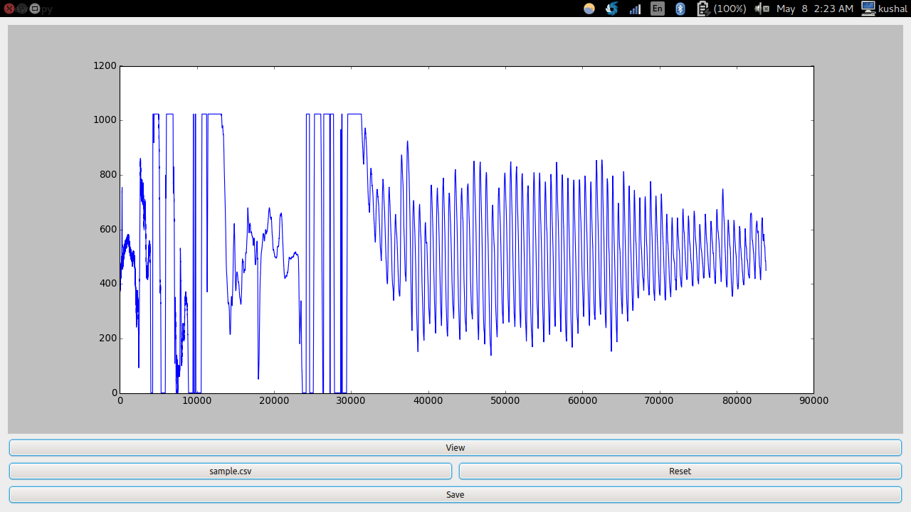
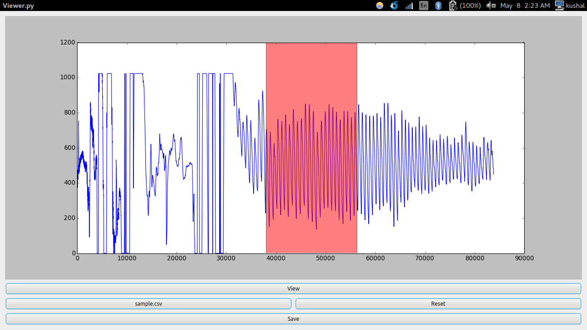

# Py-Waveform-Clipper

This is just a simple GUI tool for visualizing a waveform ( stored as a CSV file ), and to clip / span it. 

Requires PyQt4 

You can save the trimmed file as well.

To run : python viewer.py